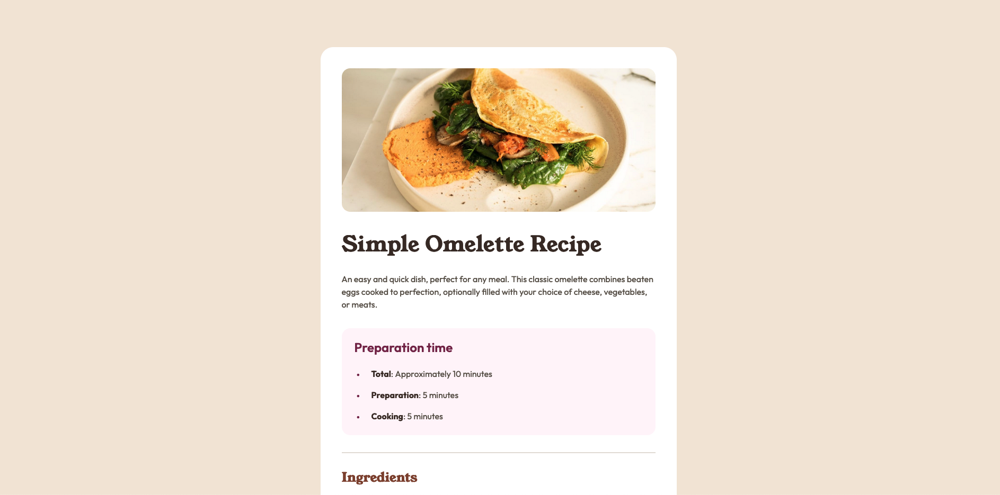

# Frontend Mentor - Recipe page solution

This is a solution to the [Recipe page challenge on Frontend Mentor](https://www.frontendmentor.io/challenges/recipe-page-KiTsR8QQKm). Frontend Mentor challenges help you improve your coding skills by building realistic projects.

## Table of contents

- [Frontend Mentor - Recipe page solution](#frontend-mentor---recipe-page-solution)
  - [Table of contents](#table-of-contents)
  - [Overview](#overview)
    - [Screenshot](#screenshot)
    - [Links](#links)
  - [My process](#my-process)
    - [Built with](#built-with)
    - [What I learned](#what-i-learned)

## Overview

### Screenshot



### Links

- Solution URL: [Check it out here](https://github.com/chrisvn188/recipe-page)
- Live Site URL: [Check it out here](https://chrisvn188.github.io/recipe-page/)

## My process

### Built with

- Semantic HTML5 markup
- CSS custom properties
- Flexbox
- CSS Grid
- Mobile-first workflow

### What I learned

I used a trick with negative margin to achieve full width image in mobile view 🥳

```css
.recipe__image {
  /* a trick to make full width image */
  margin-left: calc(-1 * var(--space-md));
  margin-right: calc(-1 * var(--space-md));
  margin-top: calc(-1 * var(--space-md));
}
```
